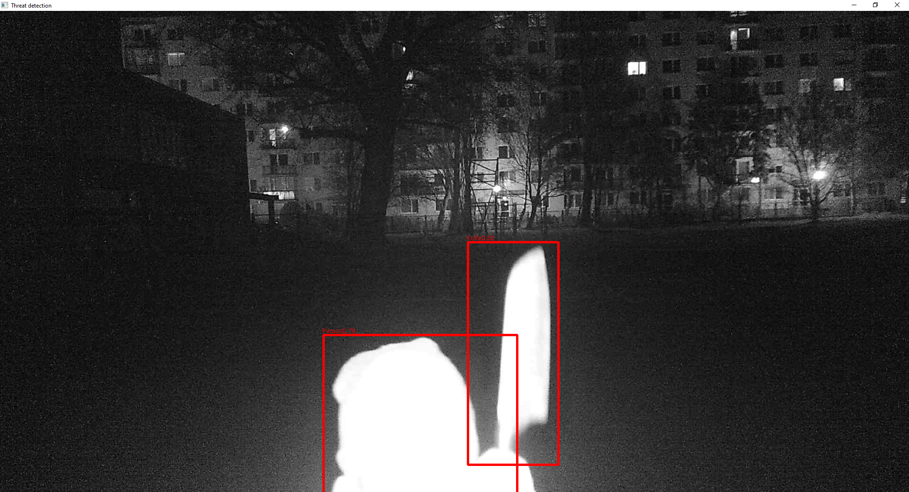
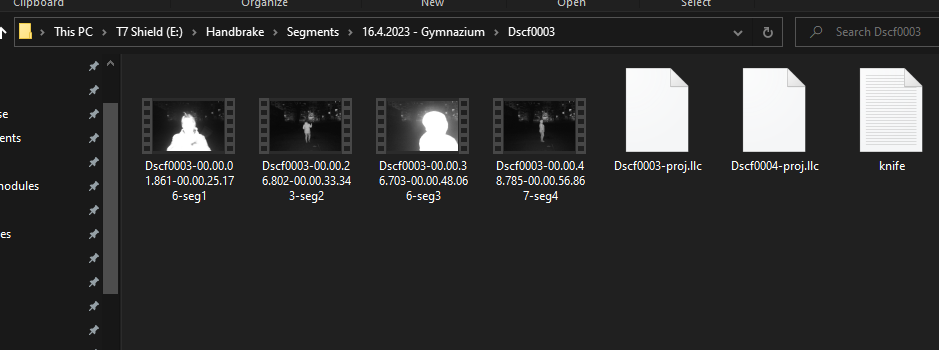
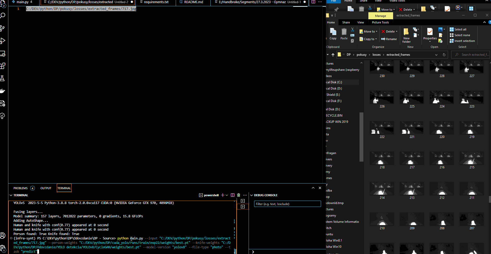
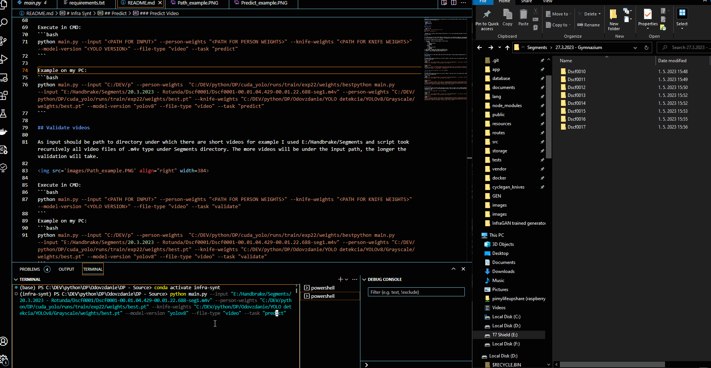

# Infra Synt

Python app for testing knife detection and validating results from pretrained YOLO models. App was tested on Windows 10 in empty Anaconda enviroment with Python 3.8.8.

## Prerequisites
- Windows or Linux
- Python 3
- CPU or NVIDIA GPU
- pip

## Getting Started
### Installation

- Clone this repo:
```bash
git clone https://github.com/Fancman/infra-synth
cd infra-synth
pip install -r requirements.txt
```

- App needs [PyTorch](https://pytorch.org/get-started/locally/) to run. You may need Admin permisions to install packages, so run CMD with as Admin.

## Dataset

To run any action you will need trained weight for detecting 'knife' class and another weight file for detecting class 'person'. Our pretrained models are in [Google drive](https://drive.google.com/drive/folders/1upL1yKbS4b1rHjmJRKnmwK5Gpqcd47Iv?usp=sharing) 

All directories in Google Drive are listed bellow:

1. YOLO models - Contains pretrained weights for YOLO versions
	1. YOLOv8
		1. RGB
		2. Grayscale-Inverted
		3. Grayscale
		4. CycleGAN
	2. YOLOv5
		1. RGB
		2. Grayscale-Inverted
		3. Grayscale
		4. CycleGAN
2. Short Videos - Contains short videos for validation task 
3. GAN generators - Contains pretrained GAN generators weights
4. Datasets - Contains images captured with night vision


## Predict

This functionality will show prompt window with either selected image or video and applies bounding boxes on it. Close window with pressing Q key.

### Predict Image

In command line go inside same directory as is main.py. Replace <> with your values, see my example under. Window should show with image and bounding boxes.

Execute in CMD:
```bash
python main.py --input "<PATH FOR INPUT>" --person-weights "<PATH FOR PERSON WEIGHTS>" --knife-weights "<PATH FOR KNIFE WEIGHTS>" --model-version "<YOLO VERSION>" --file-type "photo" --task "predict"
```

Example on my PC:
```bash
python main.py --input "C:/DEV/python/DP/pokusy/losses/extracted_frames/25.jpg" --person-weights "C:/DEV/python/DP/cuda_yolo/runs/train/exp22/weights/best.pt" --knife-weights "C:/DEV/python/DP/Odovzdanie/YOLO detekcia/YOLOv8/Grayscale/weights/best.pt" --model-version "yolov8" --file-type "photo" --task "predict"
```



### Predict Video

In command line go inside same directory as is main.py. Replace <> with your values, see my example under. Window should show with video frames and bounding boxes.

Execute in CMD:
```bash
python main.py --input "<PATH FOR INPUT>" --person-weights "<PATH FOR PERSON WEIGHTS>" --knife-weights "<PATH FOR KNIFE WEIGHTS>" --model-version "<YOLO VERSION>" --file-type "video" --task "predict"
```

Example on my PC:
```bash
python main.py --input "E:/Handbrake/Segments/20.3.2023 - Rotunda/Dscf0001/Dscf0001-00.01.04.429-00.01.22.688-seg1.m4v" --person-weights "C:/DEV/python/DP/cuda_yolo/runs/train/exp22/weights/best.pt" --knife-weights "C:/DEV/python/DP/Odovzdanie/YOLO detekcia/YOLOv8/Grayscale/weights/best.pt" --model-version "yolov8" --file-type "video" --task "predict"
```

## Validate videos

As input should be path to directory under which there are short videos for example I used E:/Handbrake/Segments and script took recursively all video files of .m4v type under Segments directory. The more videos will be under the input path, the longer the validation will take.



Execute in CMD:
```bash
python main.py --input "<PATH FOR INPUT>" --person-weights "<PATH FOR PERSON WEIGHTS>" --knife-weights "<PATH FOR KNIFE WEIGHTS>" --model-version "<YOLO VERSION>" --file-type "video" --task "validate"
```
Example on my PC:
```bash
python main.py --input "E:/Handbrake/Segments/20.3.2023 - Rotunda/Dscf0001/Dscf0001-00.01.04.429-00.01.22.688-seg1.m4v" --person-weights "C:/DEV/python/DP/cuda_yolo/runs/train/exp22/weights/best.pt" --knife-weights "C:/DEV/python/DP/Odovzdanie/YOLO detekcia/YOLOv8/Grayscale/weights/best.pt" --model-version "yolov8" --file-type "video" --task "validate"
```


## Examples

Gif images of examples for every action

### Predict video


### Predict photo



### Validate short videos

